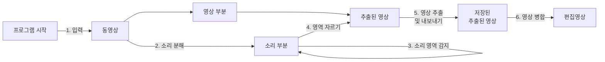

문서정보 : 2022.09.20.~ 작성, 작성자 [@SAgiKPJH](https://github.com/SAgiKPJH)

<br>

# [프로젝트 1] 영상편집 도우미 in python

## 동작 과정


<br>

## 목적
- 영상편집을 할 때, 핵심부분만 따로 추출하는 프로그램을 만드는 목적



## 목표

- [x] 0. 환경 구성
  - [x] Python 환경 기본 구성
  - [x] 설치된 Python, pip VScode에 연결하기
  - [x] VLC 미디어 재생기
  - [x] Test 영상 선정
- [x] 1. 영상 입력
  - [x] 영상 정보 획득
  - [x] Python-VLC로 영상 실행 제어
  - [x] Python-VLC 영상 재생 표준
  - [x] Python-VLC 소리 정보 시각화
- [x] 2. 소리부분 추출
  - [x] 소리부분 추출 최종 목적
  - [x] 소리 파형 이미지화 방법
  - [x] librosa를 통한 wav 파일 파형 시각화
  - [x] moviepy를 통한 mp4 > mp3 파일 변환
  - [x] pydub를 통한 mp3 > wav 파일 변환
  - [x] Python으로 소리 이미지 출력
- [ ] 3. 소리영역 감지
  - [ ] Python으로 소리 이미지 그래프 가공
  - [ ] Python으로 소리 크기 획득
  - [ ] 소리 일정부분 이상 감지
- [ ] 4. 영역 자르기
  - [ ] 영상 자르기
- [ ] 5. 영상 추출 및 내보내기
  - [ ] 영상 내보내기
- [ ] 6. 영상 병합 작업 및 내보내기
  - [ ] 영상 내보내기
  - [ ] 최적화

### 제작 기간
- 09/20 (화) ~

### 제작자
[@SAgiKPJH](https://github.com/SAgiKPJH)


---

<br><br><br>

## 0. 환경 구성

### Python 환경 기본 구성

- Python 설치
  - Python 사이트를 통해 최신 버전을 설치한다.
- VScode
  - Python은 VScode를 통해 구현한다.
  - VScode에 Python을 설치한다.
- Jupyter Nodebook
  - Jupyter Nodebook을 통해 단계별 과정을 실험한다.
  - Python으로 영상을 다루는 방법을 알기 위해 VScode에 jupyter를 설치하고 실행한다.
  - 설치 후 [View] > [Command Palette...(명령 팔레트...)] > ">create" 입력 > [Python: Create New Black Jupyter Notebook] 클릭 > Jupyter Notebook을 생성한다.

<br>

### 설치된 Python, pip VScode에 연결하기

- VScode에 설치된 pip와 python을 연결한다.
  - python 위치 획득
    - 설치된 Python 프로그램 위치에 이동한다.
    - 윈도우 > python 검색 > python 3.10 파일의 위치 열기 > python 위치 획득
    - 파일 위치 예) C:\Users\UserName\AppData\Local\Programs\Python\Python310\
  - pip 위치 획득
    - python 폴더 > Scripts 폴더 > pip 및 pip3가 존재함을 확인
    - 파일 위치 예) C:\Users\UserName\AppData\Local\Programs\Python\Python310\Scripts\
  - 윈도우 > 고급 시스템 설정 보기 검색 후 실행 > 시스템 속성 창 > 환경 변수 > [UserName에 대한 사용자 변수]와 [시스템 변수]에 존재하는 path > Python 폴더위치 및 pip 폴더 위치를 등록한다.  
  
- pip가 정삭작동함을 확인한다.
  - Terminal에 pip 명령어의 동작 여부를 확인한다.  
  
<br>

### VLC 미디어 재생기


- VLC 미디어 플레이어(VLC media player)는 비디오랜(VideoLAN) 프로젝트가 개발한 자유-오픈 소스 미디어 플레이어 소프트웨어이다.
- VLC는 데스크톱 운영 체제, 그리고 안드로이드, iOS, iPadOS, 타이젠, 윈도우 10 모바일, 윈도우 폰 등 모바일 플랫폼용으로 내려받을 수 있다.
- 비디오랜 소프트웨어는 1996년 학술 프로젝트의 하나로서 기원하였다.
- [VLC 미디어 플레이어 사이트](https://www.videolan.org/vlc/)를 통해 VLC 미디어 플레이어를 다운 받는다.
- "pip3 install python-vlc"를 통해 파이썬에 설치한다.
- 다음 코드를 실행하여 문제가 없음을 확인한다.
  ```python
  import vlc
  ```
<br>

### Test 영상 선정


- 영상 3개 선정
  - 영상 1 : 8초짜리 영상
  - 영상 2 : 1분 17초짜리
  - 영상 3 : 8초 짜리


<br><br><br>

## 1. 영상 입력

- Python으로 영상을 제어할 수 있다.

### 영상 정보 획득

- Python으로 영상을 받아서 실행한다.
- 코드를 다음과 같이 작성한다.
  ```python
  import vlc
  import time
  
  # vlc 미디어 플레이어 객체 생성하기
  media_player = vlc.MediaPlayer()
  
  # 재생할 뮤직비디오 파일을 vlc 모듈의 미디어로 변환.
  media = vlc.Media("영상1.mp4")
  
  # 읽어드린 미디어를 재생할 수 있도록 
  # 미디어 플레이어 객체에 세팅 (재생 준비 상태)
  media_player.set_media(media)
  
  # start playing video
  media_player.play()
  
  # wait so the video can be played for 5 seconds
  # irrespective for length of video
  time.sleep(0.05)
    
  # 비디오 정보 출력
  print("Frame Rate per Second(fps) : ")
  print(media_player.get_fps())
  print("Video Width x Height : ")
  print(str(media_player.video_get_width())
   + " x " +
   str(media_player.video_get_height()) )
  print("Audio Volume : ")
  print(media_player.audio_get_volume())
  print("Video_Length : ")
  print(media_player.get_length()/1000)
  
  media_player.stop()
  media_player.release()
  ```
- 결과는 다음과 같다.
  ```bash
  Frame Rate per Second(fps) : 
  29.87755012512207
  Video Width x Height : 
  1920 x 1080
  Audio Volume : 
  100
  Video_Length : 
  8.197
  ```

<br>

### Python-VLC로 영상 실행 제어
  
- VLC를 이용햐여 영상을 재생하고 정지 및 종료한다.
  ```python
  media_player = vlc.MediaPlayer()
  media = vlc.Media("영상2.mp4")
  media_player.set_media(media)
  
  # 영상 스케일 조정
  media_player.video_set_scale(0.4)
  time.sleep(1)
  print(f"영상 스케일 : {media_player.video_get_scale}이다.")
  
  # 볼륨 조정
  media_player.audio_set_volume(80)
  time.sleep(1)
  print(f"영상 볼륨 : {media_player.audio_get_volume}이다.")
  
  # 영상 1초 일지중지
  media_player.pause()
  time.sleep(1)
  
  # 영상 1초 재생
  media_player.play()
  time.sleep(1)
  
  # 영상 1초 중지
  media_player.stop()
  time.sleep(1)
  
  # 영상 다시 재생
  media_player.play()
  time.sleep(1)
  
  # 영상 위치 지정
  media_player.set_position(0.3) # 30%
  time.sleep(3)
  print(f"  - 영상 재생시간: {media_player.get_time()}")
  print(f"  - 영상 재생위치: {media_player.get_position()}")
  print("\n")
  
  # 영상 배속
  media_player.set_rate(1.5) # 1.5배
  time.sleep(3)
  print(f"  - 현재 재생 속도: {media_player.get_rate()}")
  print("\n")
  media_player.set_rate(1) # 1배
  
  
  # 음소거
  media_player.audio_toggle_mute()
  time.sleep(1)
  value = media_player.audio_get_mute()
  print(f"  - 현재 음소거 상태: {value}")
  print("\n")
   
  # 음소거 해제
  media_player.audio_toggle_mute()
  time.sleep(1)
  value = media_player.audio_get_mute()
  print(f"  - 현재 음소거 상태: {value}")
  print("\n")
   
  # 전체화면 - 영상비율도 같이 바꿔줘야 합니다.
  media_player.video_set_scale(2)
  media_player.set_fullscreen(True)
  time.sleep(1)
  print("  - 현재 Full screen 상태(get_fullscreen): ", media_player.get_fullscreen())
  print("\n")
   
  # 전체화면 해제 - 영상비율도 같이 바꿔줘야 합니다.
  media_player.video_set_scale(0.4)
  media_player.toggle_fullscreen()
  time.sleep(1)
  print("  - 현재 Full screen 상태(get_fullscreen): ", media_player.get_fullscreen())
  print("\n")
  
  # 영상 해제
  media_player.release()
  ```
  

<br>

### Python-VLC 영상 재생 표준

- 영상이 종료되면 Release()되도록 구성한다.
  ```python
  # 영상 끝까지 재생 후 종료
  media_player = vlc.MediaPlayer()
  
  # Event
  def my_call_back(event):
      print("콜백함수호출: 종료호출")
      global status 
      status = 1 
  media_player.event_manager().event_attach(
      vlc.EventType.MediaPlayerStopped, my_call_back)
  
  # Setting
  media_player.set_media(vlc.Media("영상1.mp4"))
  media_player.video_set_scale(0.2)
  media_player.play()
  
  # 자동 종료
  status = 0
  while True:
      time.sleep(0.3)
      if status == 1:
          media_player.release()
      else:
          pass
  ```

### Python-VLC 소리 정보 시각화

- 소리 정보 시각화를 위해서는 다음 코드를 수정하여 진행한다.
- 옵션 중 `--effect-list=<string>`의 문자열값은 dummy, scope, spectrum, spectrometer, vuMeter 중에 하나의 값을 선택한다.
- `--effect-fft-window` 옵션의 값은 hann, flattop, blackmanharris, kaiser 이 리스트 중 하나의 값을 선택한다.
  ```python
  # media_player = vlc.MediaPlayer()

  instance = vlc.Instance(
      "--audio-visual=visual",
      "--effect-list=spectrum",
      "--effect-fft-window=flattop")
  
  media_player = instance.media_player_new()
  ```
- 다음과 같이 소리 시각화 코드를 구성한다.
  ```python
  # 소리의 시각화
  instance = vlc.Instance(
      "--audio-visual=visual",
      "--effect-list=spectrum",
      "--effect-fft-window=flattop")
  media_player = instance.media_player_new()
  
  # 이벤트
  def my_call_back(event):
      print("콜백함수호출: 종료호출")
      media_player.release()
  media_player.event_manager().event_attach(
      vlc.EventType.MediaPlayerStopped, my_call_back)
  
  # 영상 설정
  media_player.set_media(vlc.Media("영상1.mp4"))
  media_player.video_set_scale(0.2)
  media_player.play()
  ```
- 결과  
  

<br>

## 2. 소리부분 추출 

### 소리부분 추출 최종 목적

[](https://nachwon.github.io/faster-waveform/) (이미지 출처 : https://nachwon.github.io/faster-waveform/)
- 최종적인 목적은, 소리의 크기를 시간대별로 획득 할 수 있어야 한다.
- 이는 소리를 이미지화를 이룸으로써 위 문제도 해결할 수 있는 준비를 갖출 수 있다.
- 이를 위해서 소리를 이미지화 할 수 있고, 제어를 할 수 있는 python 라이브러리를 찾아본다.

<br>

### 소리 파형 이미지화 방법

- 찾아본 결과 librosa 라이브러리를 통해 wav 파일의 파형을 시각화 할 수 있다.
- 이를 위해서 pydub를 통해 mp3를 wav 파일로 변환한다.
- mp4 파일을 mp3로 변환하기 위해 moviepy 라이브러리를 사용한다.
  ```mermaid
  flowchart LR
  A(("mp4"))--moviepy-->B(("mp3"))--pydub-->C(("wav"))--librosa-->D("파형 이미지 획득")
  ```

<br>

### librosa를 통한 wav 파일 파형 시각화

  

- 소리 추출을 위해서, 소리 관련 python 라이브러리인 librosa를 사용한다.  
  `pip install librosa`
- librosa를 사용하기 위해서 기본적으로 ffmepg를 설치해야 한다.  
  `pip install ffmpeg-python`
- 이후 다음과 같이 코드를 작성하여, 문제가 없는지를 확인한다.
  ```python
  import numpy as np
  import librosa, librosa.display 
  import matplotlib.pyplot as plt
  ```
- 문제가 없으면 다음 코드를 통해 이미지화한다.
  ```python
  filepath = "D:/test/영상1.wav"
  
  sig, sr = librosa.load(filepath, sr=22050)
  
  plt.figure(filepath)
  librosa.display.waveshow(sig, sr, alpha=0.5)
  plt.xlabel("Time (s)")
  plt.ylabel("Amplitude")
  plt.title("Waveform")
  ```
- 결과는 다음과 같다.  
  
- 시간대 별로 소리크기를 확인할 수 있다.

<br>

### moviepy를 통한 mp4 > mp3 파일 변환

- wav 파일을 통해 파형 이미지를 획득할 수 있다.
- mp4를 wav 파일로 변환하기 위한 라이브러리는 찾기 힘들다.
- mp3를 wav 파일로 변환하는 pydub라는 라이브러리가 존재하기에, mp4를 mp3로 변환하는 라이브러리를 찾았다.
- mp4를 mp3로 변환할땐, moviepy를 활용한다.
  ```mermaid
  flowchart LR
  A(("mp4"))--moviepy-->B(("mp3"))--pydub-->C(("wav"))--librosa-->D("파형 이미지 획득")
  ```
- mp4 to mp3 변환을 위해서, python 라이브러리인 moviepy를 사용한다.
- 다음 내용을 Terminal에 입력하여 moviepy를 설치한다.  
  `pip install moviepy`
- 이후 다음과 같이 코드를 작성하여, 문제가 없는지를 확인한다.
  ```python
  import moviepy.editor as mp
  ```
- 문제가 없으면 다음 코드를 통해 변환한다.
- [📌주의] 반드시 파일 이름은 영문으로 작성한다.
  ```python
  clip = mp.VideoFileClip("movie.mp4")
  clip.audio.write_audiofile("movie.mp3")
  ```
- 결과는 다음과 같다.  
  
- 직접 소리 파일을 재생하여, 문제가 없는지 확인한다.

<br>

### pydub를 통한 mp3 > wav 파일 변환

- mp3 to wav 변환을 위해서, python 라이브러리인 pydub를 사용한다.
- 다음 내용을 Terminal에 입력하여 pydub를 설치한다.  
  `pip install pydub`
- librosa를 사용하기 위해서 기본적으로 ffmepg를 설치해야 한다.  
  `pip install ffmpeg-python`
- 이후 다음과 같이 코드를 작성하여, 문제가 없는지를 확인한다.
  ```python
  import pydub                    # 생략 가능
  from pydub import AudioSegment
  import ffmpeg
  ```
- 문제가 없으면 다음 코드를 통해 변환한다.
- [📌주의] 반드시 파일 이름은 영문으로 작성한다.
  ```python
  clip = mp.VideoFileClip("movie.mp4")
  clip.audio.write_audiofile("movie.mp3")
  ```
- [‼FileNotFoundError 발생시]
  - 다른 환경에서 이상없이 작동하는지 확인한다.
  - [Colab에서는 무사히 작동한다]  
      
  - ffmpeg를 설치하여 환경을 구성한다.
  - [ffmpeg 설치 참고 출처](https://digital-play.tistory.com/104#google_vignette)
    1. [ffmpeg](https://ffmpeg.org/) 사이트에서 Download를 진행한다.  
         
       - ffmpeg 사이트 -> Download -> 아래 Window 마크 링크 -> Release 버전 압축파일(essentials 또는 Full버전)을 다운받는다.
    2. 다운로드 된 압축파일을 c드라이브(메인드라이브)에 "ffmpeg"라는 폴더명 안에 푼다.
    3. 윈도우의 "명령 프롬프트"를 관리자 권한으로실행한다.  
        
    4. 다음 내용을 입력한다.
       ```bash
       setx /m PATH "C:\ffmpeg\bin;%PATH%"
       ```
    5. 컴퓨터 재시작 후 ffmpeg가 제대로 동작하는지 확인한다.
       ```bash
       ffmpeg -version
       ```
       
- 결과는 다음과 같다.  
    
- 직접 소리 파일을 재생하여, 문제가 없는지 확인한다.  
    

<br>

### Python으로 소리 이미지 출력

- moviepy, pydub, librosa를 활용하여 mp4 영상의 소리를 추출하여 크기를 시간대별 시각화한다.
  ```python
  InputFileName = "edit"

  print("Start Converting mp4 to mp3...")
  # mp4 to mp3
  import moviepy.editor as mp
  
  clip = mp.VideoFileClip(InputFileName+".mp4")
  clip.audio.write_audiofile(InputFileName+".mp3")
  
  print("Start Converting mp3 to wav...")
  # mp3 to wav
  import pydub
  from pydub import AudioSegment
  import ffmpeg
  
  audSeg = AudioSegment.from_mp3(InputFileName+".mp3")
  audSeg.export(InputFileName+".wav", format="wav", bitrate=16)
  
  print("Start making Visualization wav...")
  
  # wav to Visualization
  import numpy as np
  import librosa, librosa.display 
  import matplotlib.pyplot as plt
  
  filepath = InputFileName+".wav"
  
  sig, sr = librosa.load(filepath, sr=22050)
  
  plt.figure(filepath)
  librosa.display.waveshow(sig, sr, alpha=0.5)
  plt.xlabel("Time (s)")
  plt.ylabel("Amplitude")
  plt.title("Waveform")
  ```
- 결과는 다음과 같다.  
    
- 8.2초 영상의 소리를 변환하는데, 7.5초가 경과하였다.
- 이를 토대로 함수화를 진행한다.
  ```python
  # mp4 to mp3
  import moviepy.editor as mp
  # mp3 to wav
  import pydub
  from pydub import AudioSegment
  import ffmpeg
  # wav to Visualization
  import numpy as np
  import librosa, librosa.display 
  import matplotlib.pyplot as plt
  
  def getSoundVolume(name, sr) : 
      # mp4 to mp3
      print("Start Converting mp4 to mp3...")
      clip = mp.VideoFileClip(name+".mp4")
      clip.audio.write_audiofile(name+".mp3")
      # mp3 to wav
      print("Start Converting mp3 to wav...")
      audSeg = AudioSegment.from_mp3(name+".mp3")
      audSeg.export(name+".wav", format="wav", bitrate=16)
      # wav to Visualization
      print("Start making Visualization wav...")
      filepath = name+".wav"
      sig, sr = librosa.load(filepath, sr)
      return sig, sr
  ```
- 다음과 같이 활용한다.
  ```python
  InputFileName = "edit"
  sig, sr = getSoundVolume(InputFileName, 2000)
  ```
- 8.2초 영상의 소리를 획득하는데, 1.3초가 경과하였다.
- 다음과 같이 이미지 출력을 함수화 한다.
  ```python
  def drawSoundImage(sig, sr) :
      librosa.display.waveshow(sig, sr, alpha=0.5)
      plt.xlabel("Time (s)")
      plt.ylabel("Amplitude")
      plt.title("Waveform")
  ```
- 다음과 같이 활용한다.
  ```python
  drawSoundImage(sig, sr)
  ```
    


<br>

## 3. 소리영역 감지

- 원하는 소리 영역을 감지하기 위해 소리정보를 가공하여 다룬다.

<br>

### Python으로 소리 이미지 그래프 가공

- librosa 함수를 사용할 때 각 설정들은 다음과 같은 뜻을 갖고 있다.
  - param sr : 1초당 분해수이다.
  - sig : 분해단위당 볼륨크기 np 배열
  - sig.size : 총 분해단위 수
  - sig.size / sr : 총 분해단위수 / 1초 분해단위수 = 영상 길이(초)
  - 1/sr : 분해단위의 길이
- 다음 함수를 통해 일반 출력을 진행한다.
  ```python
  import numpy as np
  import librosa, librosa.display 
  import matplotlib.pyplot as plt
  
  filepath = InputFileName+".wav"
  dsecs = 2000
  
  sig, sr = librosa.load(filepath, sr=dsecs)
  
  plt.figure(filepath)
  librosa.display.waveshow(sig, sr, alpha=0.5)
  plt.xlabel("Time (s)")
  plt.ylabel("Amplitude")
  plt.title("Waveform")
  ```
  
- 다음 함수를 통해 절댓 값 출력을 진행한다.
  ```python
  import matplotlib.pyplot as plt

  plt.plot(np.arange(0., sig.size/dsecs, 1/dsecs), abs(sig))
  ```
  
- 다음 코드를 통해 적분 값을 가져온다.
  ```python
  import matplotlib.pyplot as plt
  import copy
  
  plt.plot(np.arange(0., sig.size/dsecs, 1/dsecs), abs(sig))
  
  sig1 = copy.deepcopy(sig)
  
  for i in range(1, sig.size) :
      sig1[i]=0
      sig1[i] = sig1[i-1] +  abs(sig[i])
  
  plt.plot(np.arange(0., sig.size/dsecs, 1/dsecs), sig1)
  plt.show()
  ```
  
- 다음 코드를 통해 일정한 범위의 적분을 가져온다.
  ```python
  import matplotlib.pyplot as plt

  plt.plot(np.arange(0., sig.size/dsecs, 1/dsecs), abs(sig))
  
  sig1 = copy.deepcopy(sig)
  n = 1 # 측정 범위 1초
  dd = dsecs * n
  
  for i in range(1, sig.size-1, dd) :
      sig1[i] = 0
      for j in range(0, int(dd)) :
          a = 0
          if i+(j-dd/2) < 0 or i+(j-dd/2) >= sig.size:
              a = 0
          else :
              a = sig[int(i+(j-dd/2))]
          sig1[i] += abs(a)
  
  plt.plot(np.arange(0., sig.size/dsecs, 1/dsecs), sig1/dd)
  
  plt.show()
  ```
  
- 8.2초의 소리를 가공하여 0.6초 안에 정보를 획득했다.
- 최종적으로 다음과 같은 코드로 작성한다.
  ```python
  import matplotlib.pyplot as plt
  import copy
  
  plt.plot(np.arange(0., sig.size/dsecs, 1/dsecs), abs(sig))
  
  sig1 = np.zeros(1)
  
  n = 0.7 # 측정 범위 1초
  dd = dsecs * n
  
  for i in range(1, sig.size-1, int(1000*n/4)) :
      k = 0
      for j in range(0, int(dd)) :
          a = i+(j-dd/2)
          if not(a < 0 or a >= sig.size):
              k += abs( sig[int(a)] )
      sig1 = np.insert(sig1, -1 , k )
          
  
  plt.plot(np.arange(0., (sig.size+200)/sr, 1*((sig.size+200)/sr/sig1.size)), sig1/dd)
  
  plt.show()
  ```
  
- 8.2초의 소리를 가공하여 0.5초 안에 정보를 획득했다.
- 이 정보를 토대로 함수화를 진행한다.
  ```python
  def getSoundIntegral(sig, sr, dsec, n = 1) : 
      sig1 = np.zeros(1)
      dd = dsecs * n
  
      for i in range(1, sig.size-1, int(1000*n/4)) :
          k = 0
          for j in range(0, int(dd)) :
              a = i+(j-dd/2)
              if not(a < 0 or a >= sig.size):
                  k += abs( sig[int(a)] )
          sig1 = np.insert(sig1, -1 , k )
      
      return sig1, dd
  ```
- 다음과 같이 활용한다.
  ```python
  import matplotlib.pyplot as plt
  import copy
  
  sig1, dd = getSoundIntegral(sig, sr, dsec, 1)
  ```
- 다음과 같이 이미지화를 구성한다.
  ```python
  def drawGraphVolume(sig1, dd) :
      plt.plot(np.arange(0., sig1.size, 1), sig1/dd)
      plt.show()
  ```
- 다음과 같이 활용한다.
  ```python
  drawGraphVolume(sig1, dd)
  ```
  


### Python으로 소리 실시간 이미지화


### Python-VLC 으로 소리 크기 획득

## 결과
- 8.2초 영상의 소리를 이미지 정보로 변환하는데, 7.5초가 경과하였다.
  - 8.2초 영상의 소리를 획득하는데, 1.3초가 경과하였다.
- 8.2초의 소리를 가공하여 0.6초 안에 정보를 획득했다.

  

### 참조

- [VScode Jupyter NoteBooks 실행 방법](https://junglow9.tistory.com/10)
- [OpenCV install](https://hello-bryan.tistory.com/124)
- [Python, VScode 연결](https://joy-notes.com/vscode-%ED%8C%8C%EC%9D%B4%EC%8D%AC-pip-%EC%84%A4%EC%B9%98-%EC%9C%88%EB%8F%84%EC%9A%B0%EC%9A%A92022%EB%85%84-%EA%B8%B0%EC%A4%80/)
- [OpenCV VideoCapture, VideoProperty](https://wikidocs.net/28)
- [Python OpenCV VideoCapture](https://scribblinganything.tistory.com/491)
- [Python OpenCV And Audio Player ffpyplayer](https://dreamfuture.tistory.com/10)
- [ffpyplayer](https://pypi.org/project/ffpyplayer/)
- [python-VLC](https://scv-life.tistory.com/111?category=982165)
- 소리 시각화
  - [파이썬 오디오 라이브러리 Top 5종 (Python Audio Library )](https://richwind.co.kr/174)
  - [librosa](https://hyunlee103.tistory.com/36)
  - [librosa Update Error](https://develop247.tistory.com/35)
- mp4 to mp3
  - [파이썬을 이용해 동영상에서 오디오 추출하기](https://codingnuri.com/extracting-audio-from-video-using-python/)
- ffmpeg
  - [[파이썬 활용] ffmpeg 설치하기](https://digital-play.tistory.com/104#google_vignette)
- ffmpeg
  - [ffmpeg 다운로드와 간단한 사용 방법](https://seogilang.tistory.com/1578)
- plt
  - https://wikidocs.net/92071
- matlab
  - https://wikidocs.net/92071
- python 문법
  - [조건문 if else](https://wikidocs.net/57)
  - [and or 연산](https://wikidocs.net/22211)
  - [얕은 복사, 깊은 복사](https://blockdmask.tistory.com/576)