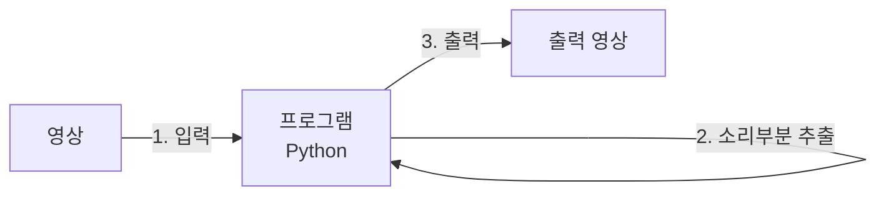

문서정보 : 2022.09.20.~ 작성, 작성자 [@SAgiKPJH](https://github.com/SAgiKPJH)

 

# [프로젝트 1] 영상편집 도우미 in python

## 목적

- 영상편집을 할 때, 핵심부분만 따로 추출하는 프로그램을 만드는 목적

### 제작 기간
- 09/20 (화) ~

### 목표
- [x] : [목적을 이루기 위한 목표1]

### 제작자
[@SAgiKPJH](https://github.com/SAgiKPJH)

### 참조

- [참조링크](참조링크)