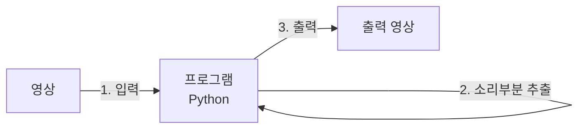

문서정보 : 2022.09.20.~ 작성, 작성자 [@SAgiKPJH](https://github.com/SAgiKPJH)

<br>

# [프로젝트 1] 영상편집 도우미 in python

## 목적

- 영상편집을 할 때, 핵심부분만 따로 추출하는 프로그램을 만드는 목적



### 목표
- [ ] : 1. 환경 구성
- [ ] : 2. 영상 받기
  - [ ] Test 영상 선정
  - [ ] Test 영상 Python으로 출력
  - [ ] Python으로 영상 제어
  - [ ] Python으로 영상 중간에서 틀기
  - [ ] Python으로 소리 출력
  - [ ] Python으로 소리 이미지화
  - [ ] Python으로 소리 실시간 이미지화
  - [ ] 최적화
- [ ] : 3. 영상 편집
  - [ ] 소리 일정부분 이상 감지
  - [ ] 영상 자르기
  - [ ] 최적화
- [ ] : 4. 영상 출력
  - [ ] 영상 내보내기

### 제작 기간
- 09/20 (화) ~

### 제작자
[@SAgiKPJH](https://github.com/SAgiKPJH)


---

<br><br><br>

## 1. 환경 구성

### Python 환경 기본 구성

- Python 설치
  - Python 사이트를 통해 최신 버전을 설치한다.

<br>

### 설치된 Python, pip VScode에 연결하기

- VScode
  - Python은 VScode를 통해 구현한다.
  - VScode에 Python을 설치한다.
- Jupyter Nodebook
  - Jupyter Nodebook을 통해 단계별 과정을 실험한다.
  - Python으로 영상을 다루는 방법을 알기 위해 VScode에 jupyter를 설치하고 실행한다.
  - 설치 후 [View] > [Command Palette...(명령 팔레트...)] > ">create" 입력 > [Python: Create New Black Jupyter Notebook] 클릭 > Jupyter Notebook을 생성한다.
- VScode에 설치된 pip와 python을 연결한다.
  - python 위치 획득
    - 설치된 Python 프로그램 위치에 이동한다.
    - 윈도우 > python 검색 > python 3.10 파일의 위치 열기 > python 위치 획득
    - 파일 위치 예) C:\Users\UserName\AppData\Local\Programs\Python\Python310\
  - pip 위치 획득
    - python 폴더 > Scripts 폴더 > pip 및 pip3가 존재함을 확인
    - 파일 위치 예) C:\Users\UserName\AppData\Local\Programs\Python\Python310\Scripts\
  - 윈도우 > 고급 시스템 설정 보기 검색 후 실행 > 시스템 속성 창 > 환경 변수 > [UserName에 대한 사용자 변수]와 [시스템 변수]에 존재하는 path > Python 폴더위치 및 pip 폴더 위치를 등록한다.  
  
- pip가 정삭작동함을 확인한다.
  - Terminal에 pip 명령어의 동작 여부를 확인한다.
<br>

## OpenCV


- OpenCV(Open Source Computer Vision)은 실시간 컴퓨터 비전을 목적으로한 프로그래밍 라이브러리이다.
- C++와 Python에서 연동 사용 가능하다.
- pip3 install opencv-python를 통해 install 한다.
- VScode 터미널을 통해 pip3 install opencv-python을 진행한다.
- Python 코드에서 "import cv2"가 동작됨을 확인하다.


<br><br><br>

## 2. 영상 받기

- Python으로 영상을 받고 가공할 수 있다.

### Test 영상 선정

- 영상 3개 선정
  - 영상 1 : 8초짜리 영상
  - 영상 2 : 1분 17초짜리
  - 영상 3 : 8초 짜리

<br><br>

### 영상 정보 획득

- Python으로 영상을 받아서 실행한다.
- 코드를 다음과 같이 작성한다.
  ```python
  import cv2

  video = cv2.VideoCapture( '영상1.mp4' )
  
  if video.isOpened():
      fps = video.get(cv2.CAP_PROP_FPS)
      f_count = video.get(cv2.CAP_PROP_FRAME_COUNT)
      f_width = video.get(cv2.CAP_PROP_FRAME_WIDTH)
      f_height = video.get(cv2.CAP_PROP_FRAME_HEIGHT)
  
      print('fps:', fps)
      print('f_count:', f_count)
      print('f_width:', f_width)
      print('f_height:', f_height)
      print('Video_Length:', f_count / fps)
  ```
- 보다 축약하여 다음과 같이 구성한다.
  ```python
  import cv2

  class videos():
      def __init__(self, string):
          self.video = cv2.VideoCapture( string )
          self.name = string
          self.fps = self.video.get(cv2.CAP_PROP_FPS)
          self.f_count = self.video.get(cv2.CAP_PROP_FRAME_COUNT)
          self.f_width = self.video.get(cv2.CAP_PROP_FRAME_WIDTH)
          self.f_height = self.video.get(cv2.CAP_PROP_FRAME_HEIGHT)

      def __del__(self):
          self.video.release()
        
      def ShowProperies(self):
          print(self.name + ' 정보')
          print('  fps:', self.fps)
          print('  f_count:', self.f_count)
          print('  f_width:', self.f_width)
          print('  f_height:', self.f_height)
          print('  Video_Length:', self.f_count / self.fps)

      def Close(self):
          self.video.release()
  ```
- 다음과 같이 결과를 확인한다.
  ```python
  video1 = videos('영상1.mp4')
  video2 = videos('영상2.mp4')
  video3 = videos('영상3.mp4')
  
  video1.ShowPropeties()
  
  print(video1.name ," sec = ", video1.f_count / video1.fps)
  print(video2.name ," sec = ", video2.f_count / video2.fps)
  print(video3.name ," sec = ", video3.f_count / video3.fps)

  video1.Close()
  video2.Close()
  video3.Close()
  
  del video1
  del video2
  del video3
  ```
- 결과는 다음과 같다.
  ```bash
  영상1.mp4 정보
    fps: 29.877551020408163
    f_count: 244.0
    f_width: 1920.0
    f_height: 1080.0
    Video_Length: 8.166666666666666
  영상1.mp4  sec =  8.166666666666666
  영상2.mp4  sec =  77.36666666666666
  영상3.mp4  sec =  8.7
  ```

  
<br><br>


### Test 영상 Python으로 출력


<br><br>

### Python으로 영상 제어

<br>

### Python으로 영상 중간에서 틀기

<br>

### Python으로 소리 출력

<br>

### Python으로 소리 이미지화

<br>

### Python으로 소리 실시간 이미지화

<br>

### 최적화

<br>

## 2. 영상 편집

<br>

### 소리 일정부분 이상 감지

<br>

### 영상 자르기

<br>

### 최적화

<br>

## 3. 영상 출력

<br>

### 영상 내보내기


### 참조

- [VScode Jupyter NoteBooks 실행 방법](https://junglow9.tistory.com/10)
- [OpenCV install](https://hello-bryan.tistory.com/124)
- [Python, VScode 연결](https://joy-notes.com/vscode-%ED%8C%8C%EC%9D%B4%EC%8D%AC-pip-%EC%84%A4%EC%B9%98-%EC%9C%88%EB%8F%84%EC%9A%B0%EC%9A%A92022%EB%85%84-%EA%B8%B0%EC%A4%80/)
- [OpenCV VideoCapture, VideoProperty](https://wikidocs.net/28)